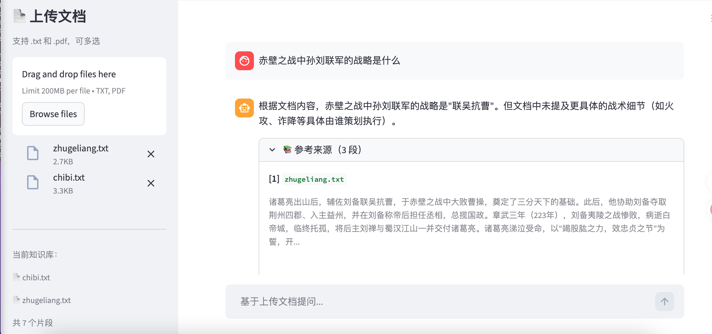

# 📚 RAG 文档智能问答系统

基于 LangChain + ChromaDB 实现的 RAG（检索增强生成）问答应用。
支持上传 PDF / TXT 文档，即传即用，回答自动标注参考来源。

Python 3.11+ LangChain ChromaDB Streamlit DeepSeek V3

🔗 **在线体验**：[https://huggingface.co/spaces/Hi-Kung/rag-document-qa](https://huggingface.co/spaces/Hi-Kung/rag-document-qa)

---

## ✨ 功能特性

- 📂 **文件上传**：支持 PDF 和 TXT，可同时上传多个文件
- 🔍 **语义检索**：基于向量相似度检索最相关的文档片段
- 💬 **多轮对话**：支持追问，保留对话上下文
- 📌 **来源引用**：每条回答标注参考了哪个文档的哪段内容
- 🚫 **拒绝幻觉**：文档中没有的内容会明确告知，不编造

## 🖥️ 界面截图



## 🚀 本地运行

```bash
git clone https://github.com/Hi-Kung/rag-document-qa
cd rag-document-qa
pip install -r requirements.txt

# 设置环境变量（在 .env 文件里或直接 export）
export SILICONFLOW_API_KEY=你的key

streamlit run app.py
```

## 🏗️ 技术架构

```
用户上传文档
    ↓
文档解析（pypdf / 直接读取）
    ↓
文本切片（RecursiveCharacterTextSplitter，chunk_size=400）
    ↓
向量化（BAAI/bge-m3 Embedding，via 硅基流动）
    ↓
存入向量库（ChromaDB 内存模式）
    ↓
用户提问 → 语义检索 Top-K 片段
    ↓
组装 Prompt → DeepSeek V3 生成回答
    ↓
展示回答 + 参考来源
```

## 📝 待优化

- 混合检索（向量 + BM25 关键词）
- Reranking 提升检索准确率
- 支持更多文件格式（Word、Markdown）
- 添加 RAGAS 自动评估

## 🙏 致谢

- [LangChain](https://python.langchain.com) - LLM 应用开发框架
- [ChromaDB](https://www.trychroma.com) - 向量数据库
- [硅基流动](https://siliconflow.cn) - API 服务（免费额度）

